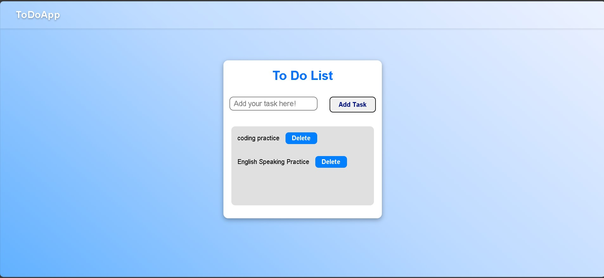

# ✅ To-Do List App

A modern and responsive To-Do List Application built using HTML, CSS, and JavaScript.  
This project helps users manage daily tasks efficiently with features like task creation, deletion, task completion, local storage, and responsive design.

---

# 🚀 Live Demo

🌐 **Website:**  
🔗 Click here - https://khushi-singh-dev.github.io/Todo-list-app/

```txt
https://khushi-singh-dev.github.io/Todo-list-app/
```

---

## 📸 Screenshot

Click the image below to view the full screenshot:

[](TodoList.jpg)

---

# ✨ Features

✅ Add new tasks  
✅ Delete tasks  
✅ Mark tasks as completed  
✅ Press Enter key to add tasks  
✅ Scrollable task section  
✅ Fully responsive design  
✅ Clean and modern UI  
✅ Beginner-friendly code structure  

---

# 🛠️ Technologies Used

| Technology | Purpose |
|------------|----------|
| HTML5 | Structure of the app |
| CSS3 | Styling & responsiveness |
| JavaScript | Functionality & DOM manipulation |

---

# 📂 Project Structure

```txt
Todo-List-App/
│
├── index.html
├── style.css
├── script.js
├── TodoList.jpg
└── README.md
```

---

# ⚡ How It Works

1. User enters a task
2. Clicks the Add button or presses Enter
3. JavaScript dynamically creates task elements
4. Tasks appear instantly on the screen
5. Users can:
   - Complete tasks
   - Delete tasks
   - Scroll through multiple tasks

---

# 🧠 Key Concepts Learned

This project helped me improve:

- DOM Manipulation
- Event Listeners
- Dynamic Element Creation
- Local Storage
- Responsive Design
- JavaScript Functions
- CSS Flexbox
- Mobile Responsiveness

---

# 📱 Responsive Design

The app is optimized for:

- 💻 Desktop
- 📱 Mobile
- 📲 Tablet

---

# 🔥 Advanced Features Added

✅ Enter key support  
✅ Task completion toggle  
✅ Scrollable task container  
✅ Responsive mobile layout  

---

# 🎯 Future Improvements

🔹 Edit task feature  
🔹 Data persistence with Local Storage  
🔹 Dynamic task counter  
🔹 Delete all tasks button  
🔹 Dark mode  
🔹 Drag and drop tasks  
🔹 Task categories  
🔹 Due dates & reminders  
🔹 Backend integration  
🔹 User authentication  

---

# 🧩 Challenges Faced

- Managing dynamic task creation
- Handling responsive layouts
- Preventing UI overflow
- Saving tasks using Local Storage
- Making task interactions smooth

---

# 🤝 Connect With Me

### 👩‍💻 Khushi Singh

- GitHub: https://github.com/khushi-singh-dev
- LinkedIn: https://linkedin.com/in/khushi-singh-68294028b
- YouTube: https://www.youtube.com/@KHUSHISATISHSINGH211

---

# ⭐ Support

If you liked this project:

⭐ Star the repository  
🍴 Fork the project  
📢 Share your feedback

---

# 📌 Project Status

✅ Completed  
🚀 Continuously improving with new features